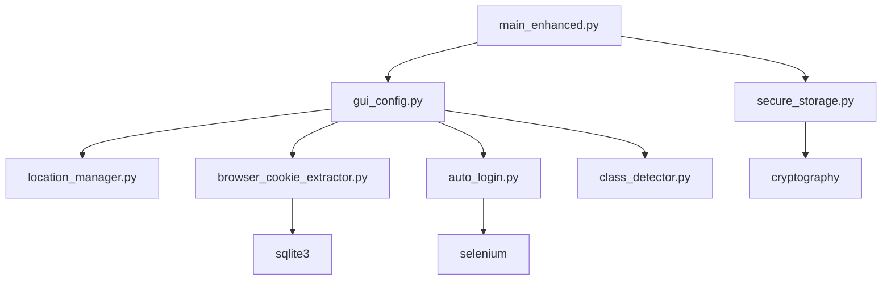

# AutoCheckBJMF 增强版

<div align="center">
    <h1>🚀 班级魔方自动签到 - 增强版</h1>
    <p>
        
        
        
    </p>
    <p>智能化、自动化、安全化的班级魔方签到解决方案</p>
</div>

## ✨ 增强功能特性

### 🎯 一键式配置体验
- **🚀 快速自动配置**: 自动检测浏览器Cookie、班级信息和GPS位置
- **🧙‍♂️ 图形化配置向导**: 友好的GUI界面，逐步引导完成配置
- **🔍 智能班级检测**: 自动从Cookie中提取班级列表，支持多班级选择
- **📍 自动位置获取**: 支持IP定位、系统GPS、手动选择多种定位方式

### 🍪 智能Cookie管理
- **🌐 多浏览器支持**: 自动从Chrome、Edge、Firefox等浏览器提取Cookie
- **🤖 自动登录获取**: 使用Selenium实现自动登录并提取Cookie
- **✅ 实时有效性检测**: 自动验证Cookie有效性，失效自动提醒
- **🔄 智能刷新机制**: 定期检查并刷新Cookie状态

### 🔒 企业级安全存储
- **🛡️ 跨平台加密**: Windows DPAPI、macOS Keychain、Linux安全存储
- **🔐 多层加密保护**: 使用Fernet对称加密保护敏感数据
- **🏠 本地安全存储**: 数据完全存储在本地，保护隐私安全
- **🔑 机器绑定密钥**: 基于机器特征生成唯一加密密钥

### 🎨 用户体验优化
- **📱 现代化界面**: 基于tkinter的现代化GUI设计
- **⚡ 快速启动模式**: 一键快速配置，3分钟完成设置
- **📊 详细状态反馈**: 实时显示签到进度和结果统计
- **🔧 灵活配置管理**: 支持配置导入导出和重置

## 🚀 快速开始

### 方法一：自动安装（推荐）

```bash
# 1. 克隆项目
git clone https://github.com/JasonYANG170/AutoCheckBJMF.git
cd AutoCheckBJMF

# 2. 运行安装脚本
python setup.py

# 3. 启动程序
python main_enhanced.py
```

### 方法二：手动安装

```bash
# 1. 安装依赖
pip install -r requirements.txt

# 2. 安装WebDriver（可选，用于自动登录）
pip install webdriver-manager

# 3. 启动程序
python main_enhanced.py
```

### Windows用户快速启动

安装完成后，可以通过以下方式启动：
- 双击 `启动AutoCheckBJMF.bat`
- 双击 `配置AutoCheckBJMF.bat`（重新配置）
- 双击桌面快捷方式

## 📖 使用指南

### 首次使用

1. **启动程序**
   ```bash
   python main_enhanced.py
   ```

2. **选择配置方式**
   - **快速配置**（推荐）：自动检测并配置所有必要信息
   - **详细向导**：逐步配置每个选项

3. **快速配置流程**
   - 程序自动从浏览器提取Cookie
   - 自动检测班级信息
   - 自动获取GPS位置
   - 一键完成配置

4. **开始签到**
   - 手动模式：立即执行签到
   - 定时模式：设置每日自动签到时间

### 配置选项详解

#### 🍪 Cookie配置
- **浏览器提取**：自动从已登录的浏览器提取Cookie
- **自动登录**：输入用户名密码，程序自动登录获取Cookie
- **手动输入**：手动复制粘贴Cookie

#### 📍 位置配置
- **自动定位**：基于IP地址自动获取大概位置
- **系统GPS**：使用系统GPS服务获取精确位置
- **手动选择**：通过地图选择器手动设置位置

#### 🏫 班级配置
- **自动检测**：从Cookie中自动提取班级列表
- **关键词搜索**：通过班级名称关键词搜索
- **手动输入**：直接输入班级ID

## 🔧 高级功能

### 多用户管理
```python
# 支持多个Cookie同时签到
cookies = [
    "username=用户1;remember_student_xxx=cookie1",
    "username=用户2;remember_student_xxx=cookie2"
]
```

### 定时任务配置
```json
{
    "scheduletime": "08:30",  // 每天8:30自动签到
    "pushplus": "your_token"  // 推送通知token
}
```

### 安全存储管理
```python
from modules.secure_storage import CookieManager

manager = CookieManager()
cookies = manager.load_cookies()  # 加载加密存储的Cookie
manager.save_cookies(cookies)     // 保存Cookie到加密存储
```

## 🛠️ 技术架构

### 核心模块

```
modules/
├── location_manager.py      # 位置管理模块
├── browser_cookie_extractor.py  # 浏览器Cookie提取
├── auto_login.py           # 自动登录模块
├── class_detector.py       # 班级检测模块
├── secure_storage.py       # 安全存储模块
└── gui_config.py          # 图形界面配置
```

### 依赖关系



## 🔒 安全特性

### 数据加密
- **传输加密**：所有网络请求使用HTTPS
- **存储加密**：本地数据使用AES-256加密
- **密钥管理**：基于机器特征生成唯一密钥

### 隐私保护
- **本地存储**：所有数据存储在本地，不上传云端
- **最小权限**：仅请求必要的系统权限
- **数据清理**：支持一键清除所有存储数据

### 安全检查
- **Cookie验证**：定期验证Cookie有效性
- **请求限制**：智能请求频率控制
- **异常检测**：自动检测异常登录状态

## 🌍 跨平台支持

### Windows
- ✅ Windows 10/11 完全支持
- ✅ DPAPI加密存储
- ✅ 桌面快捷方式
- ✅ 批处理文件启动

### macOS
- ✅ macOS 10.15+ 支持
- ✅ Keychain安全存储
- ✅ 系统GPS定位
- ✅ Shell脚本启动

### Linux
- ✅ Ubuntu/Debian/CentOS 支持
- ✅ 文件系统加密存储
- ✅ D-Bus系统集成
- ✅ 命令行友好

## 📊 性能优化

### 启动优化
- **模块懒加载**：按需加载功能模块
- **缓存机制**：配置信息智能缓存
- **并发处理**：多线程处理耗时操作

### 内存优化
- **资源管理**：自动释放浏览器资源
- **数据压缩**：配置数据压缩存储
- **垃圾回收**：主动内存垃圾回收

### 网络优化
- **请求复用**：HTTP连接复用
- **超时控制**：智能超时重试机制
- **流量控制**：请求频率智能控制

## 🐛 故障排除

### 常见问题

#### Cookie相关
```bash
# 问题：Cookie提取失败
# 解决：检查浏览器是否已登录，尝试手动输入Cookie

# 问题：Cookie过期
# 解决：程序会自动检测并提示重新获取
```

#### 定位相关
```bash
# 问题：GPS定位失败
# 解决：使用IP定位或手动输入坐标

# 问题：坐标精度不够
# 解决：使用腾讯地图坐标拾取器获取精确坐标
```

#### 系统相关
```bash
# 问题：WebDriver安装失败
# 解决：手动下载对应浏览器的WebDriver

# 问题：权限不足
# 解决：以管理员身份运行程序
```

### 日志分析
```bash
# 查看详细日志
tail -f AutoCheckBJMF_enhanced.log

# 启用调试模式
python main_enhanced.py --debug
```

## 🤝 贡献指南

### 开发环境设置
```bash
# 1. Fork项目
git clone https://github.com/your-username/AutoCheckBJMF.git

# 2. 创建开发分支
git checkout -b feature/your-feature

# 3. 安装开发依赖
pip install -r requirements.txt
pip install pytest black flake8

# 4. 运行测试
pytest tests/

# 5. 代码格式化
black modules/
flake8 modules/
```

### 提交规范
- feat: 新功能
- fix: 修复bug
- docs: 文档更新
- style: 代码格式调整
- refactor: 代码重构
- test: 测试相关
- chore: 构建过程或辅助工具的变动

## 📄 许可证

本项目采用 [GPL-3.0](LICENSE) 许可证。

## 🙏 致谢

- 感谢原项目 [AutoCheckBJMF](https://github.com/JasonYANG170/AutoCheckBJMF) 提供的基础功能
- 感谢所有贡献者和用户的支持与反馈

## 📞 联系我们

- 项目地址：https://github.com/JasonYANG170/AutoCheckBJMF
- 问题反馈：[Issues](https://github.com/JasonYANG170/AutoCheckBJMF/issues)
- 功能建议：[Discussions](https://github.com/JasonYANG170/AutoCheckBJMF/discussions)

---

<div align="center">
    <p>⭐ 如果这个项目对你有帮助，请给我们一个Star！</p>
    <p>Made with ❤️ by AutoCheckBJMF Team</p>
</div>
